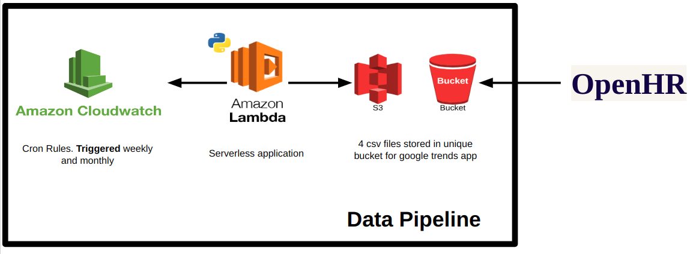

# AWS Lambda Data Pipeline

### Google Trends
Consists of 4 csv files for a flat-file database stored in Amazon s3 and scheduled in **CloudWatch** using cron rules.
* employment.csv includes time for  de-seasonalize unemployment rate, unemployment rate and subemployment rate.
* historical.csv includes time and Google trend value.
* population.csv includes information by state with proportion for males and females as well as age buckets.
* region.csv includes the time of storing, the state and the Google trend value. 

### AWS Lambda 
Kindly look at the lambda_function.py (4) files for each pipeline and the bash files (2) to create the necessary enviroment. I heavily recommend to create a folder for each pipeline, since bash files will save the libraries in the current directory and keep **lambda_function.py** name only.

### Cloud Watch
This microservice help us schedule data pipelines using **cron rules**. Time is set according to GMT.
* For INEGI data: cron expression 0 0 1 * ? * 
* For Google Trends: 0 14 ? * SUN *

