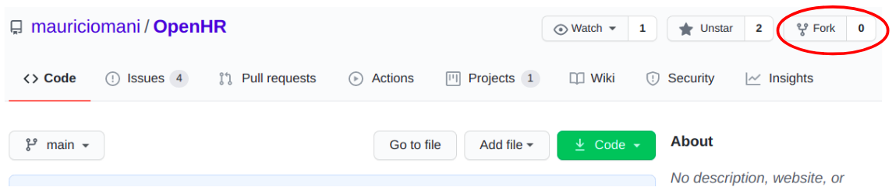
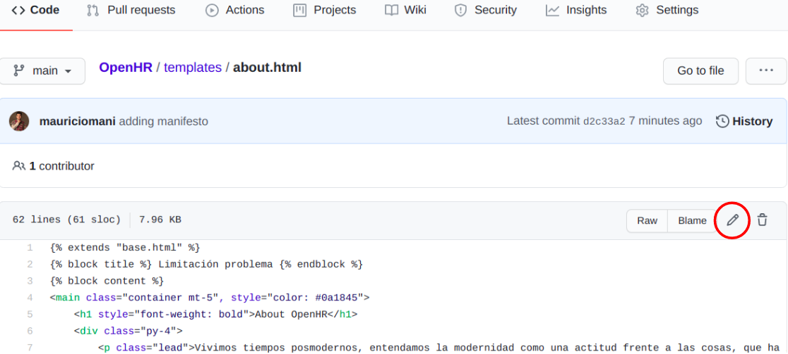
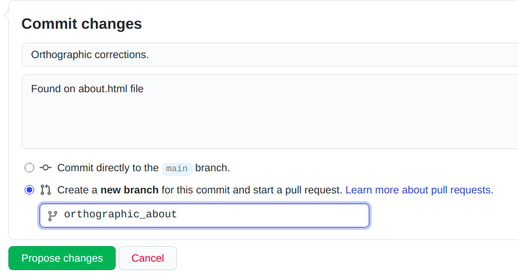
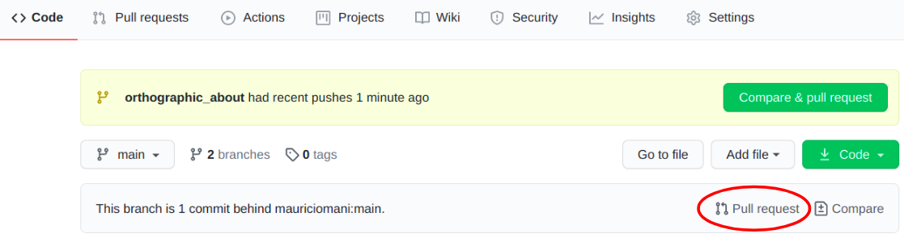
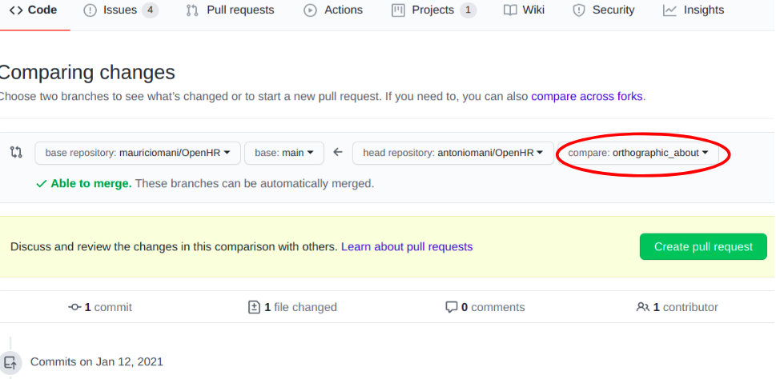
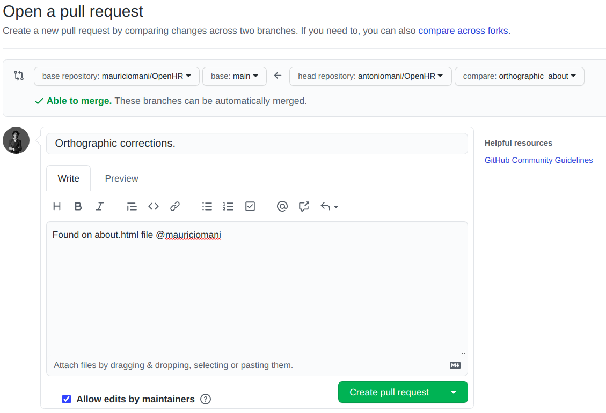

# Guide for Pull Request (PR)
Please read the following [file](https://docs.github.com/en/free-pro-team@latest/github/collaborating-with-issues-and-pull-requests/about-pull-requests), to learn more about PR. This is a short guide on how to create a PR **completely online from any web browser**. 

### Online PR creation
On the right corner of this repository please find the **fork** icon. When click it you will create a copy of this repository in your github account, this will not be downloaded to you machine, unless you want so.

Once done the above make sure you are in the forked repository and find the files that you want to edit. Inside the file find the **pencil icon**, click it, and you are ready to edit the file. 

You can also create files if needed. Once you have finish scroll down to the **commit changes** section, there please add necessary information to your commit. Make sure to create a new branch and give it a representative name (you can also commit directly to the main branch). Once you have done that you might get redirected to a Pull Request form, just exit without doing anything, since this form is for creating a pull request to the forked repository and not to the original repository. 

Go to the **main repository view** and click in the PR icon showed, not the one aside code icon.

If you have created a branch (and have not merged to main) please select it next to the forked repository as shown in the image and **click on create pull request**

Finally, just make sure there is a description for your PR and click again on **create Pull Request**. You will not be able to merge it, you can reference a user such as @mauriciomani and we will be glad to approve it.

### Cloning the repository
If you feel comfortably working on your local machine please clone the code.

